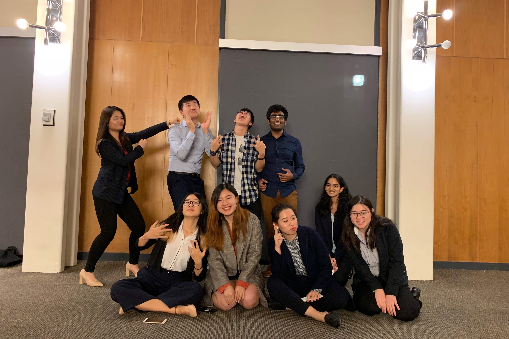
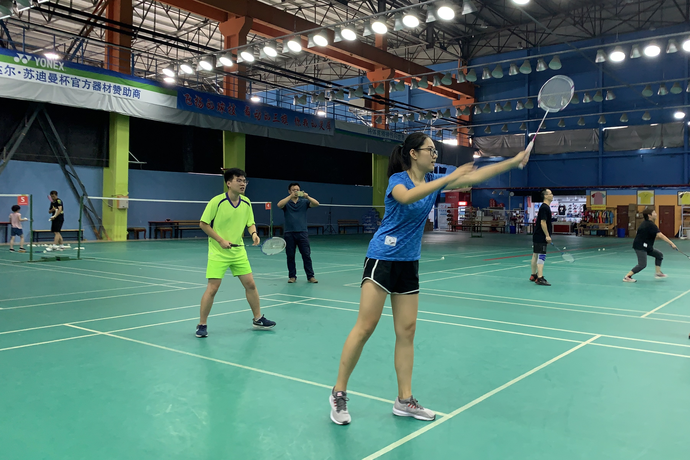

<!DOCTYPE html>
<html>
   <head>
      <title>Lucy's website</title>
      <meta charset="utf-8">
      <meta name="viewport" content="width=device-width, initial-scale=1.0">
      <!-- 引入 Bootstrap -->
      <link href="bootstrap/css/bootstrap.min.css" rel="stylesheet">
      <!-- jQuery (Bootstrap 的 JavaScript 插件需要引入 jQuery) -->
      
      

      <link rel="stylesheet" type="text/css" href="background.css">
      <link href="assets/css/font-awesome.css" rel="stylesheet">
      <link href="assets/css/docs.css" rel="stylesheet" >
      <link href="assets/css/bootstrap-social.css" rel="stylesheet" >
      <link href="assets/css/carousel.css" rel="stylesheet">

 

   </head>
   <body>
<!-- Navigation Bar Section----------------------------------------------------------------------->
      

         

          <nav class="navbar navbar-inverse">
             

              

                <a class="navbar-brand">Lucy Wang</a>
              

               

                 <ul class="nav navbar-nav">
                   <li class="active"><a href="#main" id = "nav_bar">About Me</a></li>
                   <li><a href="#whatImgoodat" id = "nav_bar" >What I'm Good At</a></li>
                   <li><a href="#skills" id = "nav_bar">Skills</a></li>
                   <li><a href="#hobbies" id = "nav_bar">Hobbies</a></li>
                   <li><a href="#contact" id = "nav_bar">Contact</a></li>
                 </ul>
               

             

          </nav>
        

      

<!-- Carousel Section----------------------------------------------------------------------->
    

      <!-- Indicators -->
      <ol class="carousel-indicators">
        <li data-target="#myCarousel" data-slide-to="0" class="active"></li>
        <li data-target="#myCarousel" data-slide-to="1"></li>
        <li data-target="#myCarousel" data-slide-to="2"></li>
      </ol>
      

        

          
          

            

              

              <h1>My Name is Lucy</h1>
              
I am an undergraduate junior studing computer science and statistics at UC Berkeley. 

              
<a class="btn btn-lg btn-primary" href="#contact" role="button">Contact Me</a>

              

            

          

        

        

          
          

            

              

              <h1>I'm a Practical Problem Solver</h1>
              
I enjoy building meaningful things through coding and data analyzing. 

              
<a class="btn btn-lg btn-primary" href="#contact" role="button">Contact Me</a>

              

            

          

        

        

          
          

            

              

              <h1>I am Actively Recruiting</h1>
              
I'm currently looking for 2020 summer software development internship, please contact me below! 

              
<a class="btn btn-lg btn-primary" href="#" role="button">Contact Me</a>

            

            

          

        

      

      <a class="left carousel-control" href="#myCarousel" role="button" data-slide="prev">
        
        Previous
      </a>
      <a class="right carousel-control" href="#myCarousel" role="button" data-slide="next">
        
        Next
      </a>
    

<!-- About Me Section-------------------------------------------------------------------------- -->
    

        

        

          
<h1 class="text-center">About Me</h1>

          

            <h2 class="featurette-heading">Hi, My name is Lucy</h2>
            
I'm currently an undergraduate junior at UC Berkeley studying computer science and statistics. 

 
            
I’m experienced with software development, and I always deliver high-quality products on a timely schedule. I also have experience in all phases of software development from designing user interfaces to implementing and testing. Moreover, my mathematical maturity also enables me to tackle challenges in a well-rounded way. 

 
            
I am currently looking for a position that would allow me to create new software and apps with my innovative ideas. I would like to use my experience to efficiently solve problems and create software that is competitive in the market and would benefit the organization. 

          

          

            

          

      

      

    

     

<!-- What I'm Good At  Section----------------------------------------------------------------------->
    

      

        

          
<h1 class="text-center">What I'm Good At</h1>

          

            

              

                

                  

                    <h2 class="panel-title">
                      <i class="fa fa-desktop" aria-hidden="true"></i>
                      <a data-toggle="collapse" data-parent="#accordion" 
                         href="#collapse6">
                        Backend Development
                      </a>
                    </h2>
                  

                  

                    

                      
I have strong coding skills and ethics. In my software engineering internship, I developed risk analysis features for a contract review platform, which includes
                       developing, testing, and packaging. I also developed algorithms to improve the task accuracy by 15%. 

                      
Some of my projects are: Building the backend API for a routing application similar to Google Maps. Implementing a tile-based game with 1000+ lines of code in Java. Building a simple C Compiler.

                    

                  

                

              

            

              

                

                  <h2 class="panel-title">
                    <i class="fa fa-codepen" aria-hidden="true"></i>
                    <a data-toggle="collapse" data-parent="#accordion" 
                       href="#collapse5">
                      Web Development
                    </a>
                  </h2>
                

                

                  

                    
I am experienced in HTML, CSS, Javascript, and Bootstrap, which I used to develop this website. My web development experience also includes designing interface prototype using AxurePR and implementing website using Vue and Django. 

                  

                

              

            

            

              

                

                  <h2 class="panel-title">
                    <i class="fa fa-line-chart" aria-hidden="true"></i>
                    <a data-toggle="collapse" data-parent="#accordion" 
                       href="#collapse2">
                      Data Analytics
                    </a>
                  </h2>
                

                

                  

                    
I interned at a data science educational startup named HasBrain, in which I conducted data analysis  from UCI open source datasets, and produced resluts as online educational material for students. 

                    
Technologies: statistical modeling, linear regression, classificaion

                  

                

              

            

          

        

      

  
      

        

            

            

              

                

                  <h2 class="panel-title">
                    <i class="fa fa-user" aria-hidden="true"></i>
                    <a data-toggle="collapse" data-parent="#accordion" 
                       href="#collapse1">
                      Leadership
                    </a>
                  </h2>
                

                

                  

                    
I was the director of Career Development Committee in Data Science Society@Berkeley, in which I lead a group of 10 people to organize career workshops and company info sessions biweekly. We also hosted the Berkeley Data Science panel, which is a full-day event and had 200+ attendees.

                  

                

              

            

            

              

                

                  <h2 class="panel-title">
                    <i class="fa fa-book" aria-hidden="true"></i>
                    <a data-toggle="collapse" data-parent="#accordion" 
                       href="#collapse3">
                      Research
                    </a>
                  </h2>
                

                

                  

                    
I worked with UC Berkeley professor Laurel Larsen on data driven appraoches of hydrological forcasting. I applied transfer entropy analysis to assess timescales of interaction between hydroclimatic variables and streamflow uisng Jupyter Notebook, and performed data cleaning on 2GB+ time-series data from 20+ hydrological stations. 

                    
Technologies: Python, Pandas, Numpy, Scikit-learn

                  

                

              

            

              
            

              

                

                  <h2 class="panel-title">
                    <i class="fa fa-globe" aria-hidden="true"></i>
                    <a data-toggle="collapse" data-parent="#accordion" 
                       href="#collapse4">
                      Public Speaking
                    </a>
                  </h2>
                

                

                  

                    
I have taken public speaking classes, and I was honored to be the event moderator at the Berkeley Data Science Panel with 200+ attendees. I have also worked as a group tutor in Student Learning Center to help students with statistics problems.

                  

                

              

            

            

          

        

      

    

     
  

<!-- Skills Section-------------------------------------------------------------------------- -->
    

      

        
<h1 class="text-center">Skills</h1>

            

              
 
                

                  <h4> Languages </h4>
                  <h6>Java   85% </h6>
                  

                    

                    

                  

                  <h6>Python  85% </h6>
                  

                    

                    

                  

                  <h6>C   65% </h6>
                  

                    

                    

                  

                  <h6>SQL 80% </h6>
                  

                    

                    

                  

                  <h6>HTML, CSS, JavaScript  80% </h6>
                  

                    

                    

                  

                
 
                

                  <h4> Technical Tools</h4>
                  

                    
                    <h5>Django</h5>
                  

                  

                    
                    <h5>Bootstrap</h5>
                  

                  

                    
                    <h5>Vue</h5>
                  

                  

                  
                  

                    
                    <h5>MySQL</h5>
                  

                  

                    
                    <h5>Git</h5>
                  

                  

                    
                    <h5>AxureRP</h5>
                  

                  
                  

                  
                

                
 
 
              

            
 
        
 

      

    

    

<!--  Hobby Section ----------------------------------------------------------------------------->

  

    
<h1 class="text-center">My Hobbies</h1>

      

        

          

            
            
My Coworkers From Statistics Tutoring

          

        

     
        

          

            
            
Our Career Development Committee

          

        

      

    
      

        

          

            
            
Biking around QingHai Lake, China 

          

        

     
        

          

            
            
Modern Dance Performance

          

        

        

          

            
            
Badminton Competition 

          

        

      

    

  

  <!-- Contact Section-------------------------------------------------------------------------- -->

    

      
      
          

            

              <h1 class="text-center">Contact Me</h1>
            

            

              

                
Please feel free to reach out to me if you have any questions, I'd love to share more about my passion and experience in computer science with you! You can also download my <a href="images/Lucy Wang Resume(swe).pdf" download="Lucy Wang Resume(swe).pdf"> resume</a> here. 
                
 <a href="mailto:wangkehua@berkeley.edu?">
                wangkehua@berkeley.edu</a>

                
 (510)-822-1176

                <ul>
                  <li class="social"><a href="https://www.facebook.com/profile.php?id=100005079105392" class="btn btn-social-icon btn-facebook"></a></li>

                  <li class="social"><a href="https://github.com/kehua1116" class="btn btn-social-icon btn-github"></a></li>

                  <li class="social"><a href="https://www.linkedin.com/in/lucy1116" class="btn btn-social-icon btn-linkedin"></a></li>
                </ul>
            

            

          

      

    

      <!-- Bootstrap core JavaScript
    ================================================== -->
    <!-- Placed at the end of the document so the pages load faster -->
    
    
    
    <!-- Just to make our placeholder images work. Don't actually copy the next line! -->
    
    <!-- IE10 viewport hack for Surface/desktop Windows 8 bug -->
    

   </body>
</html>
